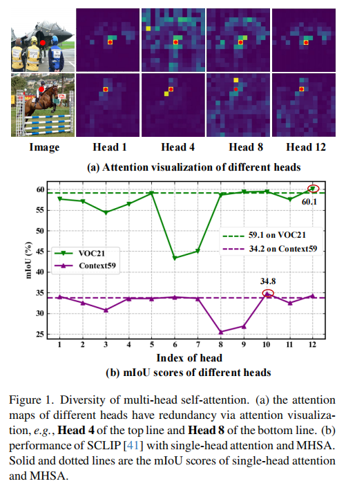
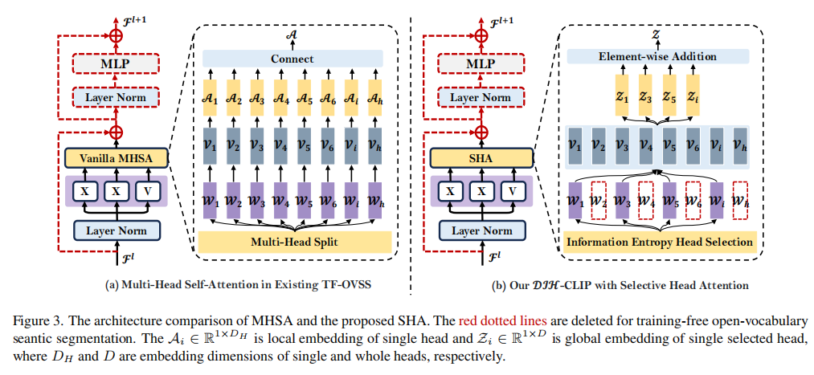
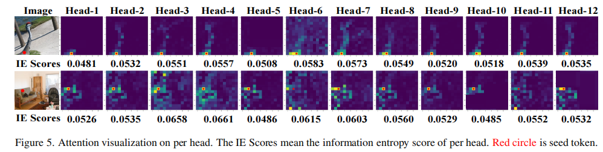
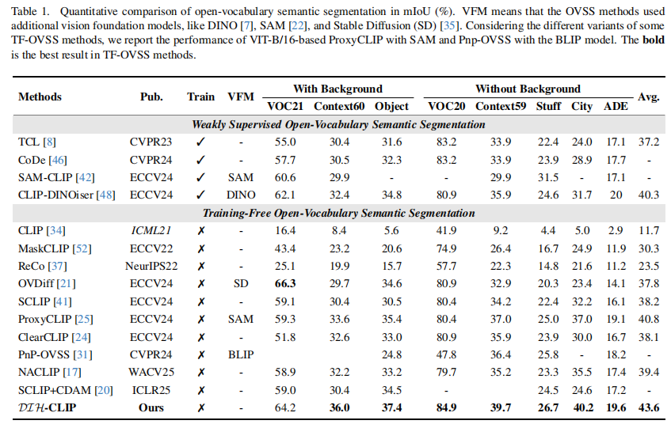
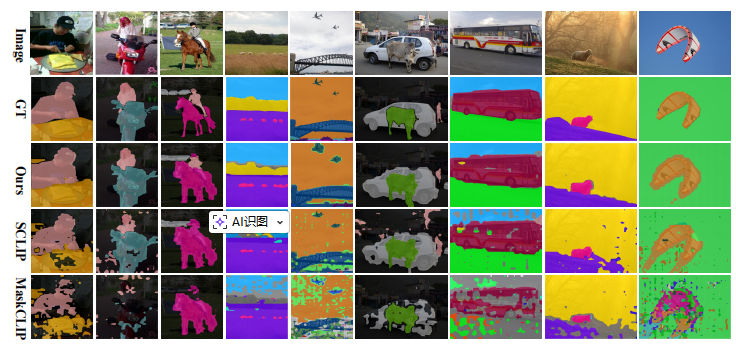

# DIH-CLIP: Unleashing the Diversity of Multi-Head Self-Attention for Training-Free Open-Vocabulary Semantic Segmentation (ICCV2025)


Official PyTorch Implementation of DIH-CLIP: Unleashing the Diversity of Multi-Head Self-Attention for Training-Free Open-Vocabulary Semantic Segmentation

<a href='https://openaccess.thecvf.com/content/ICCV2025/html/Duan_DIH-CLIP_Unleashing_the_Diversity_of_Multi-Head_Self-Attention_for_Training-Free_Open-Vocabulary_ICCV_2025_paper.html'></a> 


## Abstract
> Recent advancements in pre-trained vision-language models like CLIP, have enabled the task of open-vocabulary segmentation. CLIP demonstrates impressive zero-shot capabilities in various downstream tasks that require holistic image understanding. However, due to its image-level pre-training, CLIP struggles to capture local details, resulting in poor performance in segmentation tasks. Our analysis reveals that anomaly tokens emerge during the forward pass, drawing excessive attention from normal patch tokens, thereby diminishing spatial awareness. To address this issue, we propose Self-Calibrated CLIP (SC-CLIP), a training-free method that calibrates CLIP to produce finer-grained representations while preserving its original generalization ability, without introducing new parameters or relying on additional backbones. Specifically, we first identify and resolve the anomaly tokens to mitigate their negative impact. Next, we enhance feature discriminability and attention correlation by leveraging the semantic consistency found in CLIP's intermediate features. Furthermore, we employ multi-level feature fusion to enrich details. Collectively, these strategies enhance CLIP's feature representation with greater granularity and coherence. Experimental results demonstrate the effectiveness of SC-CLIP, achieving state-of-the-art results across eight semantic segmentation datasets and surpassing previous methods by 9.5%. Notably, SC-CLIP boosts the performance of vanilla CLIP ViT-L/14 by 6.8 times.


## Dependencies

```
pip install openmim
mim install mmcv==2.0.1 mmengine==0.8.4 mmsegmentation==1.1.1
pip install ftfy regex yapf==0.40.1
pip install torch==2.0.0+cu118
```


## Datasets
We provide the dataset configurations in this repository, following [SCLIP](https://github.com/wangf3014/SCLIP).

Please follow the [MMSeg data preparation document](https://github.com/open-mmlab/mmsegmentation/blob/main/docs/en/user_guides/2_dataset_prepare.md) to download and pre-process the datasets. The COCO-Object dataset can be converted from COCO-Stuff164k by executing the following command:

```
python ./datasets/cvt_coco_object.py PATH_TO_COCO_STUFF164K -o PATH_TO_COCO_OBJECT
```

## Model
**Framework of DIH-CLIP.** Selective Head Attention is the most of important component, which contains three parts:  
(1) computing information entropy of each attention map;  
(2) selecting attention maps;  
(3) transferring single attention maps into total features.




## Quick Inference

```
python eval.py --config ./configs/cfg_DATASET.py --workdir YOUR_WORK_DIR
```
## Results




## Citation

If you find our work useful in your research, please consider citing:

```
@inproceedings{duan2025dih,
  title={DIH-CLIP: Unleashing the Diversity of Multi-Head Self-Attention for Training-Free Open-Vocabulary Semantic Segmentation},
  author={Duan, Songsong and Yang, Xi and Wang, Nannan},
  booktitle={Proceedings of the IEEE/CVF International Conference on Computer Vision},
  pages={22794--22803},
  year={2025}
}
```

## Ackonwledge
Many thanks for CLIP:
``` bibtex
@inproceedings{radford2021learning,
  title={Learning transferable visual models from natural language supervision},
  author={Radford, Alec and Kim, Jong Wook and Hallacy, Chris and Ramesh, Aditya and Goh, Gabriel and Agarwal, Sandhini and Sastry, Girish and Askell, Amanda and Mishkin, Pamela and Clark, Jack and others},
  booktitle={International conference on machine learning},
  pages={8748--8763},
  year={2021},
  organization={PmLR}
}
```

Many thanks for SCLIP:
``` bibtex
@inproceedings{wang2024sclip,
  title={Sclip: Rethinking self-attention for dense vision-language inference},
  author={Wang, Feng and Mei, Jieru and Yuille, Alan},
  booktitle={European conference on computer vision},
  pages={315--332},
  year={2024},
  organization={Springer}
}
```


## ✉️ Statement <a name="9"></a> 
This project is for research purpose only, please contact us for the licence of commercial use. For any other questions please contact [
duanss@stu.xidian.edu.cn](duanss@stu.xidian.edu.cn).
